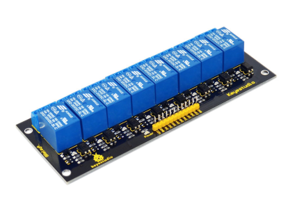
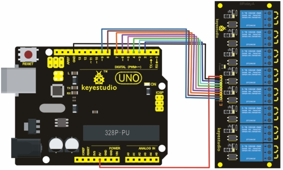

# KS0059 keyestudio 8-channel 5V Relay Module



## 1. Introduction

Arduino Relay Shield employs high quality relay with eight channels input and eight channels output. It can be connected to 250V/10A AC element or 24V/10A DC element to the maximum, therefore, it can be used to control lights, motors,etc.

The modularized design makes it easy to connect to Arduino expansion board. The output state of the relay is shown by a luminous diode for the convenience of actual application.

## 2. Specification

- Control signal: TTL voltage
- Active at HIGH level
- Rated load:
  - 10A 250VAC
  - 10A 125VAC
  - 10A 30DC
  - 10A 28VDC

- Rated Through-current: 10A(NO) 5A(NC)
- Max Switching Voltage: 250VAC 30VDC
- Contact actuation time: ＜10ms
- Definition of module pins:
  - Pin 1 -Pin 8----Controlling end
  - Power supply (VCC)
  - Ground (GND)

## 2. Connection Diagram



## 3. Sample Code

Download code : [Code](./Code.7z)

```c
int BASE = 2 ;  // I/O pin connected by the first relay
int NUM = 8;   //total number of all relays

void setup()
{
   for (int i = BASE; i < BASE + NUM; i ++) 
   {
     pinMode(i, OUTPUT);   //set digital I/O pin as output
   }
}

void loop()
{
   for (int i = BASE; i < BASE + NUM; i ++) 
   {
       digitalWrite(i, LOW);    //set digital I/O pin as ‘low’, i.e. turning off the relay gradually    
 	   delay(200);        //delay
   }
   for (int i = BASE; i < BASE + NUM; i ++) 
   {
       digitalWrite(i, HIGH);    // set digital I/O pin as ‘low’， i.e. turning on the relay gradually    
 	   delay(200);        //delay
   }  
}
```

The code sequentially turns off 8 relays connected to pins 2-9 one by one with a 200ms delay, then turns them on one by one with the same delay, creating a gradual on/off cycle.
